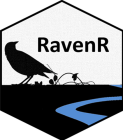

---
title: README
output: github_document
---

[](https://www.tidyverse.org/lifecycle/#experimental) [](https://travis-ci.org/rchlumsk/RavenR)
[](https://choosealicense.com/)
[](https://doi.org/10.5281/zenodo.3468442)


```{r, echo = FALSE}
knitr::opts_chunk$set(
  collapse = TRUE,
  comment = "#>",
  fig.path = "README-"
)
```

# RavenR 

RavenR is an R package for handling Raven hydrologic modelling framework inputs, outputs, and diagnostics. Please contact Robert Chlumsky (rchlumsk@uwaterloo.ca) or Dr. James Craig (jrcraig@uwaterloo.ca) for any troubleshooting, bug fixes, or recommendations on future releases.

## Installation

You can install RavenR from github with:

```{r gh-installation, eval = FALSE}
# install.packages("devtools")
library(devtools)
devtools::install_github("rchlumsk/RavenR")
```

## Tutorials and Quick Start Guide

Please see the vignettes or pdf folder for RavenR Tutorials and Quick Start Guides. Sample data is included in the package, so you need only to install the RavenR library and follow along in the guide documents to get started.

**Note that as of v1.2, the vignettes are out of date and will be updated in the next update.

## RavenR Wishlist

Any issues or feature requests can be submitted on Github via the Issues tab. You may also submit feature requests directly to Robert Chlumsky (rchlumsk@uwaterloo.ca) via email.

## Dependency Installs

Note that some of the package dependencies may require the installation of programs outside of R, particularly for Linux users. Refer to specific function helps on how to install various package materials, such as [ImageMagick](https://www.imagemagick.org/script/download.php). 

## Version Update Notes

### 2.0.0

Major updates to the package, including core package styling such as function case, naming conventions, and use of ggplot2 libraries for plotting. Some of these include:  

* all core RavenR functions have an 'rvn_' prefix to specify the package origin;    
* functions and input/output variables now use an underscore naming convention, rather than periods or camelCase;  
* ggplot2 is now the default plotting library for plotting functions, and some plotting arguments have been reduced, as ggplot objects may be modified in post-production by the user;  
* many new functions added;  
* new sample data sets and examples, including tidying of all function examples and addition of netcdf files to test netcdf-related functions;  and  
* multiple bug fixes and improvements to handling rvi, rvh, and writing rvt files.  

The version 2.0.0 of this package will be submitted to CRAN shortly, and is currently passing `R CMD CHECK`.
